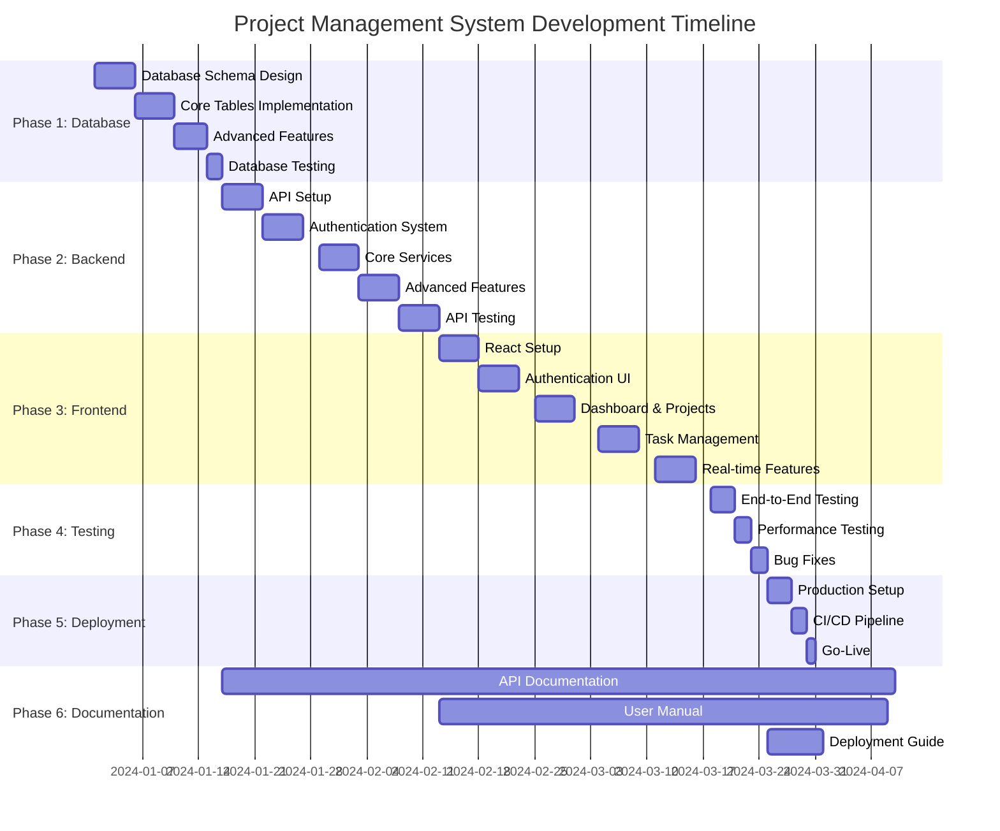

# Project Management System - Development Timeline

## Visual Timeline Overview



## Weekly Breakdown

### Week 1-2: Database Design & Setup
```
┌─────────────────────────────────────────────────────────────────┐
│ Week 1: Database Schema Implementation                        │
├─────────────────────────────────────────────────────────────────┤
│ Mon: Set up PostgreSQL environment, create core tables        │
│ Tue: Implement users, projects, tasks tables                 │
│ Wed: Add constraints, indexes, and triggers                  │
│ Thu: Create auxiliary tables (comments, attachments)         │
│ Fri: Test database connectivity and basic operations         │
└─────────────────────────────────────────────────────────────────┘

┌─────────────────────────────────────────────────────────────────┐
│ Week 2: Advanced Features & Testing                          │
├─────────────────────────────────────────────────────────────────┤
│ Mon: Implement views and stored procedures                   │
│ Tue: Create migration scripts and data seeding              │
│ Wed: Set up backup procedures and monitoring                │
│ Thu: Performance testing and optimization                    │
│ Fri: Database documentation and handover to backend team    │
└─────────────────────────────────────────────────────────────────┘
```

### Week 3-6: Backend API Development
```
┌─────────────────────────────────────────────────────────────────┐
│ Week 3: Core API Setup                                       │
├─────────────────────────────────────────────────────────────────┤
│ Mon: Set up Node.js/Express server and middleware           │
│ Tue: Create database connection and ORM setup               │
│ Wed: Implement basic CRUD operations                        │
│ Thu: Add error handling and validation middleware           │
│ Fri: Test basic API functionality                           │
└─────────────────────────────────────────────────────────────────┘

┌─────────────────────────────────────────────────────────────────┐
│ Week 4: Authentication & Core Services                       │
├─────────────────────────────────────────────────────────────────┤
│ Mon: Implement JWT authentication system                     │
│ Tue: Create user management and role-based access control   │
│ Wed: Implement project and task services                    │
│ Thu: Add input validation and sanitization                  │
│ Fri: Test authentication and core services                  │
└─────────────────────────────────────────────────────────────────┘

┌─────────────────────────────────────────────────────────────────┐
│ Week 5: Advanced Features                                   │
├─────────────────────────────────────────────────────────────────┤
│ Mon: Implement file upload and storage service              │
│ Tue: Create notification system and activity logging        │
│ Wed: Implement comment and attachment services              │
│ Thu: Add time tracking and search functionality             │
│ Fri: Test advanced features                                │
└─────────────────────────────────────────────────────────────────┘

┌─────────────────────────────────────────────────────────────────┐
│ Week 6: Real-time & Testing                                 │
├─────────────────────────────────────────────────────────────────┤
│ Mon: Implement WebSocket server for real-time updates       │
│ Tue: Add real-time notifications and event broadcasting     │
│ Wed: Write comprehensive unit tests                         │
│ Thu: Create integration tests and API documentation        │
│ Fri: Complete API testing and documentation                │
└─────────────────────────────────────────────────────────────────┘
```

### Week 7-10: Frontend UI Development
```
┌─────────────────────────────────────────────────────────────────┐
│ Week 7: Application Setup & Authentication                   │
├─────────────────────────────────────────────────────────────────┤
│ Mon: Set up React app with TypeScript and routing           │
│ Tue: Implement state management (Redux/Context)             │
│ Wed: Create authentication forms and login/logout logic     │
│ Thu: Design and implement authentication UI components       │
│ Fri: Test authentication flow and responsive design         │
└─────────────────────────────────────────────────────────────────┘

┌─────────────────────────────────────────────────────────────────┐
│ Week 8: Core Features                                       │
├─────────────────────────────────────────────────────────────────┤
│ Mon: Implement dashboard with project overview              │
│ Tue: Create project creation and management interface       │
│ Wed: Add project listing, filtering, and search            │
│ Thu: Implement project details and editing functionality    │
│ Fri: Test project management features                       │
└─────────────────────────────────────────────────────────────────┘

┌─────────────────────────────────────────────────────────────────┐
│ Week 9: Advanced Features                                   │
├─────────────────────────────────────────────────────────────────┤
│ Mon: Implement task management interface                    │
│ Tue: Add drag-and-drop functionality for tasks             │
│ Wed: Create comment system and file attachments            │
│ Thu: Implement task filtering and search                   │
│ Fri: Test task management features                         │
└─────────────────────────────────────────────────────────────────┘

┌─────────────────────────────────────────────────────────────────┐
│ Week 10: Real-time & Polish                                 │
├─────────────────────────────────────────────────────────────────┤
│ Mon: Integrate WebSocket for real-time updates             │
│ Tue: Add notification system and alerts                    │
│ Wed: Implement search and advanced filtering               │
│ Thu: Polish UI components and add animations               │
│ Fri: Final testing and optimization                        │
└─────────────────────────────────────────────────────────────────┘
```

### Week 11: Testing & Quality Assurance
```
┌─────────────────────────────────────────────────────────────────┐
│ Week 11: Comprehensive Testing                              │
├─────────────────────────────────────────────────────────────────┤
│ Mon: Create test plans and scenarios                       │
│ Tue: Perform end-to-end testing                            │
│ Wed: Conduct performance and security testing               │
│ Thu: User acceptance testing and feedback collection        │
│ Fri: Bug fixes and final optimizations                     │
└─────────────────────────────────────────────────────────────────┘
```

### Week 12: Deployment & DevOps
```
┌─────────────────────────────────────────────────────────────────┐
│ Week 12: Production Deployment                              │
├─────────────────────────────────────────────────────────────────┤
│ Mon: Set up production servers and environment             │
│ Tue: Implement CI/CD pipeline                              │
│ Wed: Configure monitoring and logging                      │
│ Thu: Performance optimization and security hardening        │
│ Fri: Go-live and post-deployment testing                   │
└─────────────────────────────────────────────────────────────────┘
```

## Critical Path Analysis

### Dependencies
1. **Database → Backend**: Backend development cannot start until database is ready
2. **Backend → Frontend**: Frontend development depends on API endpoints
3. **Authentication → All Features**: All features require authentication system
4. **Testing → Deployment**: Deployment requires successful testing

### Critical Path
```
Database Design → Backend API → Authentication → Core Services → 
Frontend Setup → UI Components → Integration Testing → Deployment
```

### Risk Mitigation
- **Parallel Development**: UI/UX design can start during backend development
- **Early Integration**: Frontend-backend integration testing starts in Week 6
- **Continuous Testing**: Testing integrated throughout development
- **Documentation**: Documentation created alongside development

## Resource Allocation

### Weekly Hours Distribution
```
Week 1-2:   Database Engineer (40h), Backend Developer (20h)
Week 3-6:   Backend Developer (40h), API Developer (30h), DevOps (10h)
Week 7-10:  Frontend Developer (40h), UI/UX Designer (30h), Full-stack (10h)
Week 11:    QA Engineer (40h), Backend Developer (20h), Frontend Developer (20h)
Week 12:    DevOps Engineer (40h), Backend Developer (20h), Frontend Developer (10h)
```

### Team Availability
- **Backend Developer**: 100% (40h/week)
- **Frontend Developer**: 100% (40h/week)
- **UI/UX Designer**: 75% (30h/week)
- **Database Engineer**: 50% (20h/week) - Weeks 1-2
- **API Developer**: 75% (30h/week) - Weeks 3-6
- **DevOps Engineer**: 50% (20h/week) - Weeks 3-6, 100% Week 12
- **QA Engineer**: 100% (40h/week) - Week 11
- **Technical Writer**: 25% (10h/week) - Throughout

## Milestone Check-ins

### Phase 1 Milestones
- **Day 3**: Core tables implemented and tested
- **Day 7**: All tables, constraints, and indexes complete
- **Day 10**: Views and stored procedures implemented
- **Day 14**: Database fully configured and tested

### Phase 2 Milestones
- **Week 3 Day 5**: Basic API structure complete
- **Week 4 Day 5**: Authentication system functional
- **Week 5 Day 5**: Core services implemented
- **Week 6 Day 5**: API fully tested and documented

### Phase 3 Milestones
- **Week 7 Day 5**: Authentication interface complete
- **Week 8 Day 5**: Dashboard and project views functional
- **Week 9 Day 5**: Task management interface complete
- **Week 10 Day 5**: Real-time features integrated

### Phase 4-5 Milestones
- **Week 11 Day 3**: Core functionality tested
- **Week 11 Day 5**: All bugs fixed and documented
- **Week 12 Day 3**: Production environment ready
- **Week 12 Day 5**: Application deployed and tested

## Success Metrics by Phase

### Phase 1 Success Metrics
- All database tables created with proper relationships
- Indexes optimized for performance
- Migration scripts tested and documented
- Backup procedures in place

### Phase 2 Success Metrics
- All API endpoints functional
- Authentication system secure
- Real-time features working
- Test coverage > 80%
- API documentation complete

### Phase 3 Success Metrics
- All UI components functional
- Responsive design implemented
- Real-time updates working
- User experience optimized

### Phase 4 Success Metrics
- All critical bugs resolved
- Performance benchmarks met
- Security vulnerabilities addressed
- User acceptance criteria satisfied

### Phase 5 Success Metrics
- Application deployed successfully
- Monitoring and logging active
- Performance optimized
- Documentation complete

This timeline provides a clear roadmap for the 12-week development cycle with specific deliverables, team assignments, and success criteria for each phase. 