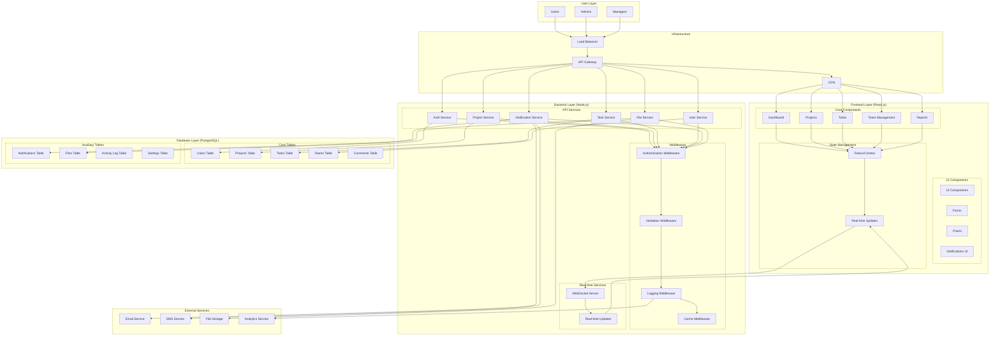

# Project Management Platform - System Architecture

## Overview
This document outlines the system architecture for a comprehensive project management platform built with React.js, Node.js, and PostgreSQL.

## Architecture Diagram



## Component Details

### Frontend Layer (React.js)

#### Core Components
- **Dashboard**: Main overview with project statistics, recent activities, and quick actions
- **Projects**: Project creation, management, and visualization
- **Tasks**: Task management with drag-and-drop functionality
- **Team Management**: User roles, permissions, and team collaboration
- **Reports**: Analytics, charts, and project insights

#### State Management
- **Redux/Context**: Centralized state management
- **Real-time Updates**: WebSocket integration for live updates

### Backend Layer (Node.js)

#### API Services
- **Auth Service**: User authentication, authorization, and session management
- **Project Service**: Project CRUD operations and business logic
- **Task Service**: Task management, assignments, and status tracking
- **User Service**: User management, profiles, and team assignments
- **Notification Service**: Email, SMS, and in-app notifications
- **File Service**: File upload, storage, and retrieval

#### Middleware
- **Authentication Middleware**: JWT token validation
- **Validation Middleware**: Request data validation
- **Logging Middleware**: Request/response logging
- **Cache Middleware**: Redis caching for performance

### Database Layer (PostgreSQL)

#### Core Tables
- **Users**: User accounts, profiles, and authentication data
- **Projects**: Project information, settings, and metadata
- **Tasks**: Task details, assignments, and status
- **Teams**: Team structures and member relationships
- **Comments**: Task and project comments

#### Auxiliary Tables
- **Notifications**: Notification preferences and history
- **Files**: File metadata and storage references
- **Activity Log**: User activity tracking
- **Settings**: Application configuration

### External Services
- **Email Service**: Transactional emails (SendGrid/AWS SES)
- **SMS Service**: SMS notifications (Twilio)
- **File Storage**: Cloud storage (AWS S3/Google Cloud Storage)
- **Analytics Service**: Usage analytics and reporting

## API Endpoints

### Authentication
```
POST /api/auth/login
POST /api/auth/register
POST /api/auth/logout
POST /api/auth/refresh
GET  /api/auth/profile
```

### Projects
```
GET    /api/projects
POST   /api/projects
GET    /api/projects/:id
PUT    /api/projects/:id
DELETE /api/projects/:id
GET    /api/projects/:id/tasks
GET    /api/projects/:id/members
```

### Tasks
```
GET    /api/tasks
POST   /api/tasks
GET    /api/tasks/:id
PUT    /api/tasks/:id
DELETE /api/tasks/:id
PUT    /api/tasks/:id/status
POST   /api/tasks/:id/assign
```

### Users
```
GET    /api/users
GET    /api/users/:id
PUT    /api/users/:id
GET    /api/users/:id/projects
GET    /api/users/:id/tasks
```

### Notifications
```
GET    /api/notifications
PUT    /api/notifications/:id/read
POST   /api/notifications/settings
```

### Files
```
POST   /api/files/upload
GET    /api/files/:id
DELETE /api/files/:id
```

## Data Flow

### User Authentication Flow
1. User submits login credentials
2. Frontend sends request to Auth Service
3. Auth Service validates credentials against database
4. JWT token generated and returned
5. Frontend stores token and updates UI

### Project Creation Flow
1. User creates project via frontend
2. Frontend sends project data to Project Service
3. Project Service validates data and creates database record
4. Notification Service sends team notifications
5. Real-time updates broadcast to team members

### Task Assignment Flow
1. Manager assigns task to team member
2. Task Service updates task assignment
3. Notification Service sends assignment notification
4. Real-time updates reflect in all connected clients
5. Email/SMS notifications sent to assignee

## Security Considerations

### Authentication & Authorization
- JWT tokens for stateless authentication
- Role-based access control (RBAC)
- Session management and token refresh
- Password hashing with bcrypt

### Data Protection
- Input validation and sanitization
- SQL injection prevention
- XSS protection
- CORS configuration
- Rate limiting

### Infrastructure Security
- HTTPS/TLS encryption
- API Gateway security
- Database connection encryption
- File upload validation

## Performance Optimizations

### Frontend
- Code splitting and lazy loading
- React.memo for component optimization
- Virtual scrolling for large lists
- Image optimization and compression

### Backend
- Database query optimization
- Redis caching for frequently accessed data
- Connection pooling
- API response compression

### Database
- Proper indexing strategy
- Query optimization
- Database partitioning for large datasets
- Regular maintenance and cleanup

## Scalability Considerations

### Horizontal Scaling
- Load balancer for traffic distribution
- Microservices architecture
- Database read replicas
- CDN for static assets

### Vertical Scaling
- Resource monitoring and auto-scaling
- Database performance tuning
- Caching strategies
- Background job processing

## Monitoring & Logging

### Application Monitoring
- Error tracking and alerting
- Performance metrics
- User activity analytics
- API usage monitoring

### Infrastructure Monitoring
- Server health monitoring
- Database performance metrics
- Network latency tracking
- Resource utilization monitoring

This architecture provides a robust foundation for a scalable project management platform with clear separation of concerns, security best practices, and performance optimizations. 