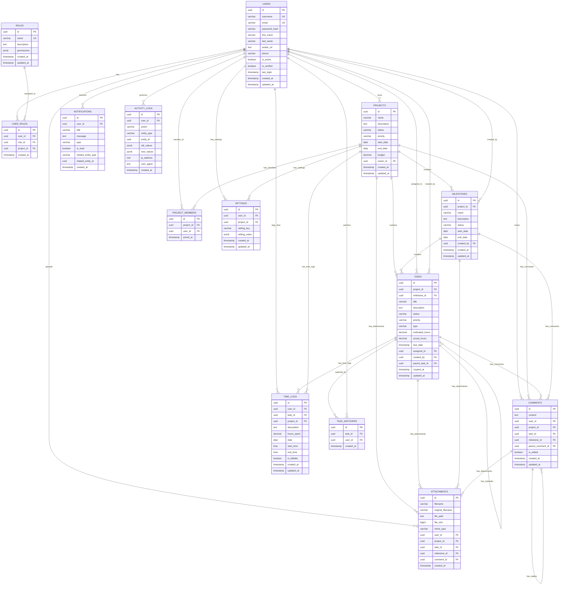

# Project Management Platform - Entity Relationship Diagram

## Database Schema Overview

This ER diagram shows the complete database structure for the project management platform, including all entities, relationships, and key attributes.

## ER Diagram

## Key Relationships Explained

### 1. **User Management**
- **Users ↔ Roles**: Many-to-many relationship through `user_roles` table
- **Users ↔ Projects**: One-to-many (ownership) and many-to-many (membership) through `project_members`

### 2. **Project Hierarchy**
- **Projects → Milestones**: One-to-many relationship
- **Projects → Tasks**: One-to-many relationship
- **Milestones → Tasks**: One-to-many relationship
- **Tasks → Subtasks**: Self-referencing one-to-many relationship

### 3. **Task Management**
- **Users ↔ Tasks**: Many-to-many through assignment and creation
- **Tasks ↔ Watchers**: Many-to-many relationship through `task_watchers`

### 4. **Content Management**
- **Comments**: Can be attached to projects, tasks, or milestones
- **Attachments**: Can be attached to projects, tasks, milestones, or comments
- **Comments**: Support nested replies through self-referencing

### 5. **Time Tracking**
- **Time Logs**: Linked to both tasks and projects for comprehensive tracking
- **Billable Hours**: Track whether time is billable to clients

### 6. **Audit and Notifications**
- **Activity Logs**: Track all user actions for audit purposes
- **Notifications**: System-wide notification system
- **Settings**: User and project-specific configurations

## Data Types and Constraints

### **Primary Keys**
- All tables use UUID primary keys for security and scalability
- UUIDs are generated using `uuid_generate_v4()` function

### **Foreign Keys**
- Proper CASCADE and RESTRICT rules for data integrity
- NULL allowed for optional relationships (e.g., unassigned tasks)

### **Check Constraints**
- Status fields have predefined valid values
- Priority fields have predefined levels
- Entity relationship constraints ensure proper associations

### **Indexes**
- Performance indexes on frequently queried columns
- Composite indexes for complex queries
- Foreign key indexes for join performance

### **Triggers**
- Automatic `updated_at` timestamp updates
- Audit trail maintenance
- Data validation triggers

## Database Features

### **PostgreSQL Specific Features**
- JSONB for flexible data storage (permissions, settings)
- INET type for IP address storage
- Full-text search capabilities
- Advanced indexing strategies

### **pgAdmin4 Compatibility**
- Proper comments for all tables and columns
- Standard PostgreSQL data types
- Compatible with pgAdmin4's schema browser
- Export/import friendly structure

### **Scalability Considerations**
- UUID primary keys for distributed systems
- Proper indexing for large datasets
- Partitioning-ready structure
- Efficient query patterns

This ER diagram provides a complete foundation for a robust project management platform with proper relationships, data integrity, and performance optimization. 